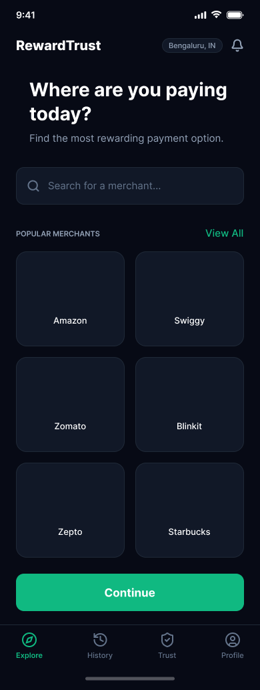
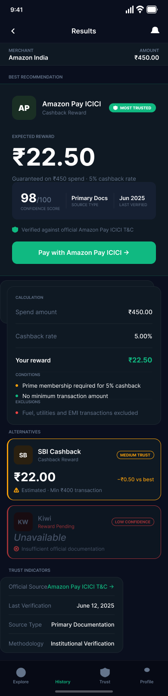

<div align="center">

# RewardTrust
### The Missing Transparency Layer for Indian UPI Rewards



---

[](https://rewardtrust.vercel.app/)
[](https://rewardtrust-audit.vercel.app/)
[](https://docs.google.com/viewer?url=https%3A%2F%2Fraw.githubusercontent.com%2FUjjwalag3784%2Frewardtrust-portfolio%2Fmain%2Fdocs%2FRewardTrust_Case_Study.pdf)
[](https://docs.google.com/viewer?url=https%3A%2F%2Fraw.githubusercontent.com%2FUjjwalag3784%2Frewardtrust-portfolio%2Fmain%2Fdocs%2FPRD_document_RewardTrust.pdf)

[](https://react.dev/)
[](https://vitejs.dev/)
[](https://vercel.com/)
[](LICENSE)
[](https://github.com/Ujjwalag3784)
[]()

---

**Product Manager:** Ujjwal Agrawal &nbsp;|&nbsp; **Domain:** Fintech x UPI x Rewards

</div>

---

## Table of Contents

- [The Problem](#the-problem)
- [Research & Discovery](#research--discovery)
- [The Four Trust Gaps](#the-four-trust-gaps)
- [User Personas](#user-personas)
- [Jobs To Be Done](#jobs-to-be-done)
- [Solution](#the-solution)
- [Product Screenshots](#product-screenshots)
- [Design System](#design-system)
- [Dataset & Audit](#dataset--audit)
- [Success Metrics](#success-metrics)
- [Technical Architecture](#technical-architecture)
- [Product Roadmap](#product-roadmap)
- [Documents & Assets](#documents--assets)
- [About the PM](#about-the-pm)

---

## The Problem

> **"I made a UPI payment with my RuPay credit card. Where's my cashback?"**

India has **600M+ UPI users** transacting daily — yet most have no idea whether they earned a reward, when it will arrive, or why it didn't show up. The reward loop is completely invisible.

<div align="center">

| Stat | Insight |
|---|---|
| **~95%** of first transactors | Miss their first reward entirely |
| **>60%** of UPI transactions | Have unclaimed or unrealized rewards |
| **~16 days** average | Time from transaction to reward discovery |
| **₹2,000–₹8,000** per year | Annual uncaptured reward value per active user |
| **3 in 5 users** | Don't know their card's reward rate before paying |

</div>

Banks and payment apps built the pipes. Nobody built the window.

---

## Research & Discovery

### Methodology

Discovery combined qualitative user interviews with a hand-curated reward rate dataset covering **20 merchants x 8 payment methods = 160 reward rate entries**, each tagged with confidence tiers (HIGH / MEDIUM / LOW). The research focused on how users perceive, discover, and act on rewards across the full payment journey.

### Research Synthesis

The problem is not the reward program — it's the **feedback loop**. Users cannot form reward habits because the entire reward experience is opaque, delayed, and fragmented across 3–5 different apps. Across every stage of the journey — from knowing a reward exists, to receiving it, to redeeming it, to repeating the behaviour — users lose visibility and trust. These breakdowns cluster into four distinct failure modes, captured below as the Four Trust Gaps.

---

## The Four Trust Gaps

Research surfaced four distinct failure modes — the **Four Trust Gaps Framework**:

<div align="center">

| Trust Gap | User Question | What Breaks |
|---|---|---|
| **Anticipation** | *"Will I earn a reward for THIS payment?"* | Users don't know reward eligibility before they transact |
| **Delivery** | *"Did my reward actually credit?"* | No real-time confirmation of reward credit post-transaction |
| **Status** | *"Where is my reward right now?"* | Zero visibility into pending or processing reward states |
| **Explanation** | *"Why didn't I get my reward?"* | No human-readable reason when rewards don't credit as expected |

</div>

Each gap is a product opportunity. RewardTrust is built to close all four.

---

## User Personas

### MVP Primary: Divya — The Cautious Optimizer

> *"I use UPI because it's convenient, but I always wonder if I'm leaving money on the table."*

| Attribute | Detail |
|---|---|
| **Age** | 26, Bengaluru |
| **Occupation** | Software Engineer, 3 YOE |
| **Income** | ₹80K/month |
| **Behavior** | Makes 30+ UPI transactions/month, owns 2 credit cards |
| **Pain Point** | Has earned rewards but never successfully redeemed; gave up after 2 failed attempts |
| **Goal** | Confidence that her payment choice is optimized, without extra effort |

---

### MVP Primary: Arjun — The Accidental Rewarder

> *"I don't care about points, I care about cashback hitting my account."*

| Attribute | Detail |
|---|---|
| **Age** | 31, Mumbai |
| **Occupation** | Sales Manager |
| **Income** | ₹1.2L/month |
| **Behavior** | High-value transactions, rarely checks reward balance |
| **Pain Point** | Lost ₹4,000+ in rewards last year — found out only during a bank audit |
| **Goal** | A single source of truth for what he's earned and when it arrives |

---

### Secondary: Priya — The Reward Enthusiast

> *"I've memorized my reward rates. But I shouldn't have to."*

Priya researches before every transaction. She's the power user who exposes just how broken the existing experience is — even for people who *try* to optimize.

---

### Secondary: Rahul — The Digital Newcomer

> *"Someone told me I get 5% cashback. I'm not sure I ever got it."*

Rahul joined UPI credit recently. His first experience sets the tone for his lifetime value. Poor transparency is costing banks customers like Rahul before loyalty even forms.

---

## Jobs To Be Done

```
When I'm about to make a high-value payment,
I want to know which card/method gives me the best reward,
So that I don't miss out on benefits I'm already entitled to.
──────────────────────────────────────────────────────────────
When my payment completes,
I want immediate confirmation that my reward credited,
So that I can trust the system and build a payment habit.
──────────────────────────────────────────────────────────────
When I check my rewards,
I want to understand the current status in plain language,
So that I know exactly when and how much I'll receive.
──────────────────────────────────────────────────────────────
When a reward doesn't credit,
I want a clear, human-readable explanation of why,
So that I don't feel deceived or lose trust in the product.
```

---

## The Solution

RewardTrust is a **reward transparency layer** — a companion experience that surfaces reward intelligence at every stage of the payment journey.

### Four Core Experiences (1:1 with Trust Gaps)

<div align="center">

| Experience | Trust Gap Closed | User Value |
|---|---|---|
| **Reward Preview** | Anticipation | See exact reward before paying |
| **Reward Confirmation** | Delivery | Instant credit confirmation post-payment |
| **Reward Status Tracker** | Status | Real-time pending/credited/failed tracking |
| **Reward Explainer** | Explanation | Plain-English reason when rewards don't land |

</div>

### Product Principles

1. **Zero extra effort** — reward intelligence surfaces passively in the payment flow
2. **Plain language first** — no jargon, no fine print, just "₹120 cashback expected in 3–5 days"
3. **Trust by default** — every state shown, every exception explained
4. **Data integrity** — confidence-tiered reward rates (HIGH/MEDIUM/LOW) with source attribution

---

## Product Screenshots

<div align="center">

### Home — Reward Preview


---

### Reward Rate Discovery


---

### Post-Transaction Confirmation


---

### Status Tracker


---

### Reward Explainer


</div>

> **Try the live product:** [rewardtrust.vercel.app](https://rewardtrust.vercel.app/)

---

## Design System

<div align="center">


*Full UI flow designed in Figma — search, results, and reward detail screens*



*Reward rate results view with confidence indicators and merchant breakdown*

</div>

**Design Principles Applied:**
- Progressive disclosure (most relevant info first)
- Confidence signaling (color-coded HIGH/MEDIUM/LOW tiers)
- Mobile-first, UPI-native interaction patterns
- Minimal cognitive load — one action per screen

---

## Dataset & Audit

The MVP is powered by a **hand-curated, audited dataset** of 160 reward rate entries across 20 merchants and 8 payment methods — the first of its kind in the Indian market.

<div align="center">

[](https://rewardtrust-audit.vercel.app/)

</div>

### Dataset Specs

| Dimension | Coverage |
|---|---|
| **Merchants** | 20 (Swiggy, Zomato, Amazon, Flipkart, BigBasket, Myntra + more) |
| **Payment Methods** | 8 (UPI Credit, RuPay, Visa, Mastercard, AMEX, Debit, Wallet, BNPL) |
| **Total Entries** | 160 reward rate data points |
| **Data Format** | JSON flat-file (MVP) -> Supabase (Phase 2) |
| **Confidence Tiers** | HIGH (verified) · MEDIUM (inferred) · LOW (estimated) |
| **Update Protocol** | Manual quarterly audits -> automated crawlers (Phase 3) |

**Download Dataset:** [RewardTrust_Dataset_2025.xlsx](assets/RewardTrust_Dataset_2025.xlsx)

---

## Success Metrics

### North Star Metric

<div align="center">

**Reward Discovery Rate (RDR)** — the percentage of users who discover their reward within 24 hours of a qualifying transaction.

| Stage | RDR Target |
|---|---|
| Baseline | ~12% |
| MVP Target | 35% |
| 12-month | 55% |

</div>

### L1 Metrics (Primary)

| Metric | Baseline | MVP Target | Why It Matters |
|---|---|---|---|
| Reward Discovery Rate | ~12% | 35% | Core product value delivery |
| Reward Comprehension Score | ~21% | 65% | Understand what they earned |
| Reward Redemption Rate | ~18% | 40% | Completing the value loop |
| D30 Retention | ~8% | 25% | Habit formation signal |

### L2 Metrics (Secondary)

| Metric | Target |
|---|---|
| Time to First Reward Discovery | < 24 hours (from ~16 days) |
| Reward Preview Engagement Rate | > 45% of sessions |
| Explainer Click-through Rate | > 30% on failed rewards |
| NPS | > 40 (fintech benchmark: 32) |

### Guardrail Metrics *(must not regress)*
- App load time < 2s on 4G
- Data accuracy complaints < 1% of sessions
- Zero instances of false reward confirmation

---

## Technical Architecture

**Frontend:** React + Vite, Tailwind CSS, hosted on Vercel.

**Data Layer:** JSON flat files (160 reward rate entries) for the MVP, migrating to Supabase (real-time, scalable) in Phase 2, with automated crawlers and ML confidence scoring in Phase 3.

**Integrations:** UPI payment webhooks (Phase 2), bank API partnerships (Phase 3), and a B2B API for payment apps (Phase 4).

**Tech Stack:**

[](https://react.dev/)
[](https://vitejs.dev/)
[](https://tailwindcss.com/)
[](https://vercel.com/)
[](https://developer.mozilla.org/en-US/docs/Web/JavaScript)
[](https://supabase.com/)

---

## Product Roadmap

**Phase 1 — MVP (Current)**
Reward Rate Discovery (20 merchants x 8 methods), confidence-tiered data display, Dataset Audit Tool, React + Vercel deployment, 160-entry JSON dataset.

**Phase 2 — Post-Transaction (Q3 2025)**
UPI webhook integration for real-time reward tracking, push notifications for reward credit/failure, Supabase migration for dynamic data, personalized reward history dashboard, reward status tracker (Pending -> Credited -> Failed).

**Phase 3 — Intelligence Layer (Q1 2026)**
ML-powered reward rate crawlers, automated confidence score updates, merchant anomaly detection, predictive reward modeling, and a "best card for this merchant" recommendation engine.

**Phase 4 — B2B API (Q3 2026)**
White-label Reward Transparency API for payment apps, bank partnership integrations, embedded reward widgets (SDK), and a per-transaction API fee revenue model.

---

## Documents & Assets

<div align="center">

| Document | Description | Link |
|---|---|---|
| **PRD v1.0** | 34-page Product Requirements Document | [View PDF](https://docs.google.com/viewer?url=https%3A%2F%2Fraw.githubusercontent.com%2FUjjwalag3784%2Frewardtrust-portfolio%2Fmain%2Fdocs%2FPRD_document_RewardTrust.pdf) |
| **Case Study** | 36-page PM Portfolio Case Study | [View PDF](https://docs.google.com/viewer?url=https%3A%2F%2Fraw.githubusercontent.com%2FUjjwalag3784%2Frewardtrust-portfolio%2Fmain%2Fdocs%2FRewardTrust_Case_Study.pdf) |
| **Dataset** | 160-entry reward rate dataset (Excel) | [Download](assets/RewardTrust_Dataset_2025.xlsx) |
| **Figma Design** | Full UI flow with design system | [View Figma](https://www.figma.com/design/W0zibobivNgcrEi2tyA1Ey/Trust-Details-Rebuilt?node-id=0-1&t=OtmwJWoKsGgvfW3B-1) |
| **Thesis Deck** | Research & vision presentation | [View PPTX](assets/RewardTrust_ThesisDeck.pptx) |
| **Why Rewards Exist** | Explainer deck on UPI reward mechanics | [View PPTX](assets/why_reward_exists.pptx) |

</div>

### Quick Links

**[Live MVP](https://rewardtrust.vercel.app/)** — Try the product now

**[Dataset Audit Tool](https://rewardtrust-audit.vercel.app/)** — Explore the reward rate database

**[Source Code](https://github.com/Ujjwalag3784/rewardtrust)** — React + Vite implementation

---

## About the PM

<div align="center">

**Ujjwal Agrawal**
*Product Manager | Fintech x Consumer x Growth*

Building products that make financial systems more transparent and equitable for Indian consumers.

This project was built to demonstrate:
- **0->1 product thinking** — from insight to shipped MVP
- **Data-driven research** — user journey analysis, qualitative + quantitative synthesis
- **PM craft** — PRD writing, persona development, metric design, roadmapping
- **Execution** — live MVP shipped, auditable dataset, real user feedback

[](https://www.linkedin.com/in/ujjwal-agrawal-113402277/)
[](https://github.com/Ujjwalag3784)

</div>

---

## Run Locally

```bash
# Clone the repository
git clone https://github.com/Ujjwalag3784/rewardtrust-portfolio.git
cd rewardtrust-portfolio

# Install dependencies
npm install

# Start development server
npm run dev

# Open http://localhost:5173
```

---

<div align="center">

**Built with conviction that Indian UPI users deserve to understand their own rewards.**

*If you're a PM hiring manager at a fintech and this work resonates — let's talk.*

[](LICENSE)
[]()
[]()

</div>
